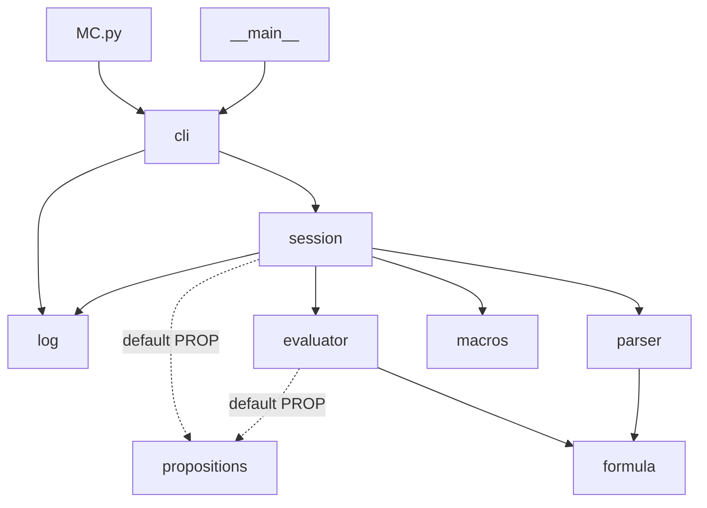
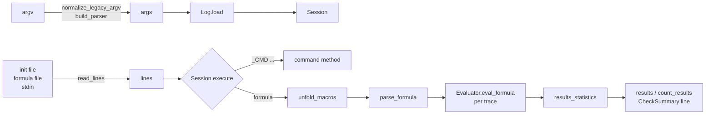

# Architecture of SemanticDLTL

This document describes how the DLTL model checker is organised and
implemented: the layers of the application, the modules and their
dependencies, the data structures that flow between them, the evaluation
algorithm, the extension points and the testing strategy. It is intended for
developers who want to modify or extend the tool; the user-facing
description of the formula language and of the command line is in
[README.md](../README.md) and [grammar.md](grammar.md).

Contents

1. [Overview](#1-overview)
2. [Repository layout](#2-repository-layout)
3. [Module dependencies](#3-module-dependencies)
4. [Data structures](#4-data-structures)
5. [Processing pipeline](#5-processing-pipeline)
6. [The evaluation algorithm](#6-the-evaluation-algorithm)
7. [The session and its commands](#7-the-session-and-its-commands)
8. [The command-line layer](#8-the-command-line-layer)
9. [Extension points](#9-extension-points)
10. [Design decisions](#10-design-decisions)
11. [Testing strategy](#11-testing-strategy)
12. [Known limitations](#12-known-limitations)

---

## 1. Overview

SemanticDLTL checks *data-aware* linear temporal logic formulas (DLTL) against the
traces of an event log. A trace is a finite sequence of events; each event
carries a set of atomic propositions and a number of typed attributes. Besides
the usual future and past LTL operators, formulas can *freeze* the current
event into a variable (`x.(...)`) and later evaluate arbitrary Python boolean
expressions over the attributes of the frozen events, which is what makes it
possible to correlate the data of different events of the same trace.

The implementation follows the algorithm of Couvreur and Ezpeleta (SIMPDA
2017): a formula is evaluated bottom-up over a whole trace at once, producing
one value per event; sub-formulas that still depend on unbound freeze
variables are kept as *partially evaluated* formulas until the variable is
bound, at which point the frozen event is substituted and the evaluation
continues.

The application is a pure-Python package with no runtime dependencies and
three layers:

```
┌───────────────────────────────────────────────────────────────┐
│  Interface       cli.py  (argparse, input readers)   MC.py    │
├───────────────────────────────────────────────────────────────┤
│  Application     session.py  (results, macros, commands)      │
│                  macros.py                                    │
├───────────────────────────────────────────────────────────────┤
│  Core            parser.py ──▶ formula.py ◀── evaluator.py    │
│                  log.py                     propositions.py   │
└───────────────────────────────────────────────────────────────┘
```

The core knows nothing about files or terminals; the application layer owns
the state of a checking session; the interface layer only translates
arguments and input streams into calls to the session.

## 2. Repository layout

```
SemanticDLTL/                (repository root)
├── MC.py                   legacy entry point (python MC.py log-file=...)
├── pyproject.toml          packaging (hatchling), pytest and ruff configuration
├── README.md  CHANGELOG.md  CITATION.cff  LICENSE
├── docs/
│   ├── grammar.md          operator precedence and formal grammar
│   └── architecture.md     this document
├── src/dltl/               the package
│   ├── __init__.py         version and public re-exports
│   ├── __main__.py         python -m dltl
│   ├── cli.py              command-line interface
│   ├── session.py          Session and CheckSummary
│   ├── macros.py           macro expansion
│   ├── parser.py           lexer and Pratt parser
│   ├── formula.py          formula node constructors and predicates
│   ├── evaluator.py        Evaluator and results_statistics
│   ├── log.py              Log (model loading, result files)
│   └── propositions.py     default user propositions (PROP)
├── tests/                  pytest suite; tests/golden holds reference outputs
├── examples/               sample model, init and formula files, semantic logs
└── scripts/                log conversion helpers (need optional dependencies)
```

The package uses the *src layout*: the code is importable only after
`pip install -e .` (or through `MC.py`, which adds `src/` to `sys.path` when
the package is not installed). This prevents tests from accidentally importing
the working copy instead of the installed package and keeps the repository
root free of importable modules.

| Module | Lines | Responsibility |
| --- | ---: | --- |
| `formula.py` | 150 | Representation of formulas: constructors for every operator, `TRUE`/`FALSE`, predicates |
| `parser.py` | 209 | Text → formula nodes |
| `evaluator.py` | 342 | Formula × trace → one value per event |
| `log.py` | 219 | `.mod` file → `Log`; result files |
| `macros.py` | 37 | Textual expansion of `?name` macros |
| `propositions.py` | 70 | Functions callable from data expressions |
| `session.py` | 195 | State of a checking session, commands |
| `cli.py` | 156 | Argument parsing, input readers, `main()` |

## 3. Module dependencies

The import graph is a directed acyclic graph; arrows point from the importing
module to the imported one.



Dashed arrows are lazy imports of the default propositions module, performed
inside a function so that a user-supplied module can replace it. The
following properties hold and are worth preserving:

* `formula`, `log`, `macros` and `propositions` import nothing from the
  package. They can be tested and reused in isolation.
* `parser` and `evaluator` depend only on `formula`, i.e. on the shape of the
  nodes, never on each other.
* Only `session` knows how the pieces fit together; only `cli` knows about
  `sys.argv`, `sys.stdin` and exit codes.

The original prototype had a cycle `DLTL ↔ log_handling` (and
`my_propositions → log_handling`) because the evaluator obtained the column
names from globals injected by the loader; the cycle disappeared once the
column index became an attribute of `Log` handed explicitly to `Evaluator`
(section 6.4).

## 4. Data structures

### 4.1 Events, traces and the `Log`

An event is a tuple. Position `I_POS` (0) holds the **position of the event
in its trace**, starting at 1; position `I_ATOM` (1) holds the **set of atomic
propositions** of the event; positions 2, 3, … hold the values of the
non-atomic attributes in header order. For the header `aE,nV,@att,$p` and the
line `id0,a&4&a;1&a=1;b=2` (first event of its trace) the event is

```python
(1, {'a'}, 4.0, {'a', '1'}, {'a': 1.0, 'b': 2.0})
# pos  E     V     att          p
```

Values are cast when loading (`log.cast_format` for `n`/`b`/`s` columns,
`log.cast` for the values inside `$` dictionaries; a non-numeric value in a
numeric column is reported and stored as `0.0`). Atomic columns do not occupy
a position: several `a` columns all contribute to the set at `I_ATOM`. The
position stored at `I_POS` is what `x[#]` denotes in data expressions
(`replace` substitutes `x[#]` textually, so both forms give the same value).

A trace is a tuple of events, and `Log` (a frozen dataclass) is the loaded
model:

| Field | Type | Meaning |
| --- | --- | --- |
| `path` | `str` | path of the `.mod` file without the suffix; result files are written next to it |
| `traces` | `dict[str, tuple[Event, ...]]` | trace id → events, in file order |
| `sorted_ids` | `list[str]` | trace ids sorted; every output uses this order |
| `atomics` | `frozenset[str]` | all atomic propositions of the log |
| `column_index` | `dict[str, int]` | non-atomic attribute name → position in the event tuple (from 2 on) |
| `attrib_desc`, `formats`, `field_names` | header information | e.g. `['aE','nV','@att','$p']`, `('a','n','@','$')`, `('E','V','att','p')` |

`n_traces`, `n_events` and `trace_lengths` are derived properties.
`column_index` is the bridge between attribute names used in formulas and
positions in the tuples: for the header above it is `{'V': 2, 'att': 3, 'p': 4}`.

### 4.2 Formulas

A formula is a plain Python list, built by the constructors of `formula.py`:

```
[vars, op, ...]
```

where `vars` is the set of freeze variables the sub-formula still depends on
and `op` identifies the operator. The remaining elements depend on `op`:

| Node | Shape | Built by |
| --- | --- | --- |
| constant | `[set(), 'True']`, `[set(), 'False']` | `TRUE()`, `FALSE()` |
| atomic proposition | `[set(), 'atom', 'a']` | `atom('a')` |
| unary operator | `[vars, '!' \| 'X' \| 'Y' \| 'F' \| 'G' \| 'O' \| 'H', exp]` | `NOT`, `X`, `Y`, `F`, `G`, `O`, `H` |
| binary operator | `[vars, '&' \| '\|' \| 'U' \| 'S', exp1, exp2]` | `AND`, `OR`, `U`, `S` |
| freeze | `[vars ∪ {z}, 'fvar', 'z', exp]` | `fvar('z', exp)` |
| data expression | `[{'x','y'}, 'exp', "x[V] == y[V]"]` | `expression({'x','y'}, "...")` |

`vars` is computed by the constructors as the union of the children's sets;
`fvar` *adds* its own variable rather than removing it, because the evaluator
needs to know, at the freeze node, which variable it must substitute
(section 6.3). The indexes `v, t, e1, e2 = 0, 1, 2, 3` name the positions.

`IMP` and `EQ` are derived (`IMP(f, g) = OR(g, NOT(f))`), as are the bounded
operators: `Xn(3, f) = X X X f`, `Fn(n, f) = f & X Fn(n-1, f)` (f holds now
and at the next n-1 events), and symmetrically `Yn`, `On`. Consequently the
evaluator only has to know the primitive operators.

The same list structure is used for **partially evaluated** formulas: during
evaluation a node whose `vars` is empty is always reduced to `TRUE()`/`FALSE()`,
and a node with a non-empty `vars` is an ordinary formula waiting for its
variables to be bound. There is thus a single representation for the input of
the evaluator, its intermediate results and its final results.

Nodes are never mutated: every transformation builds new lists. This allows
the parser to share one node among all the occurrences of an atomic
proposition and the evaluator to memoise on `id(node)`.

### 4.3 Results

The session accumulates, for each trace id, two comma-separated strings that
grow by one field per checked formula:

* `results[id] = "id,1,0,1,…"`: whether the formula holds at the **first**
  event of the trace (the classic model-checking answer);
* `count_results[id] = "id,0.5,0.0,1.0,…"`: the fraction of events of the
  trace at which the formula holds.

together with `checked_forms`, the list of formulas in the same order. These
are exactly the rows of the `.res`, `.norm` and `.forms` files written by
`_WRITE`, which is why they are kept as strings.

## 5. Processing pipeline



For one formula typed in a session the sequence of calls is:

1. `cli.read_lines` yields the line (joining lines up to `$` in multi-line
   mode).
2. `Session.execute` classifies it: empty or `;` comment (ignored), `@`
   system call, `_AGUR`/`_BYE` (end), a command with or without arguments,
   or a formula.
3. `macros.unfold_macros` replaces every `?name` by each of its values,
   producing one formula per combination.
4. `parser.parse_formula` builds the node tree (or reports a syntax error and
   returns `None`, in which case the formula is skipped).
5. For every trace, in `sorted_ids` order, `Evaluator.eval_formula` returns
   the list of per-event values and `results_statistics` reduces it to
   (holds at first event, #true, #false, ratio).
6. The session appends the outcome to the result strings, prints the
   summary line `yes,no,pct,seconds` and returns a `CheckSummary`.

## 6. The evaluation algorithm

`Evaluator.eval_formula(node, trace)` returns a list `res` with `len(trace)`
elements, `res[i]` being the value of the formula at event `i`. The algorithm
is compositional: each operator's handler first evaluates its sub-formulas
over the whole trace and then combines the resulting lists.

### 6.1 Temporal operators as backward/forward recurrences

Because traces are finite, the future operators are computed from the last
event backwards and the past operators from the first event forwards, using
the standard fixed-point characterisations:

| Operator | Recurrence | Boundary |
| --- | --- | --- |
| `X f` | `res[i] = f[i+1]` | `res[n-1] = FALSE`, except `X false` which is `TRUE` |
| `F f` | `res[i] = f[i] ∨ res[i+1]` | `res[n-1] = f[n-1]` |
| `G f` | `res[i] = f[i] ∧ res[i+1]` | `res[n-1] = f[n-1]` |
| `f U g` | `res[i] = g[i] ∨ (f[i] ∧ res[i+1])` | `res[n-1] = g[n-1]` |
| `Y f` | `res[i] = f[i-1]` | `res[0] = FALSE`, except `Y false` which is `TRUE` |
| `O f`, `H f`, `f S g` | mirror images of `F`, `G`, `U` | at `res[0]` |

The special cases of `X false` and `Y false` are what make these formulas the
idioms for "this is the last event" and "this is the first event"; they are
deliberate and documented in the README.

`F`, `G`, `O` and `H` short-circuit: once `F f` is `TRUE` at event `i+1` it is
`TRUE` at every earlier event, so the loop stops calling
`eval_formula_in_event` and fills the rest with constants (symmetrically
`FALSE` for `G`, and forwards for `O` and `H`). The result is identical, since
`f[i] ∨ TRUE` is `TRUE` whatever `f[i]` is, but on long traces it avoids most
of the work.

The propositional operators combine the two lists position-wise. Each
combination is not built naively but passed through
`eval_formula_in_event` (6.2), which simplifies it as far as possible.

### 6.2 Simplification at an event: `eval_formula_in_event`

`eval_formula_in_event(node, i, trace)` reduces a node at event `i`:

* an `atom` becomes `TRUE()`/`FALSE()` by membership in `trace[i][0]`;
* an `exp` without variables is `eval`'d (6.4) and becomes a constant;
* `&`, `|`, `!` apply the usual short-circuit rules (`FALSE & f = FALSE`,
  `TRUE & f = f`, …) so that a constant operand disappears;
* a node whose `vars` is not empty is left untouched: it cannot be decided
  yet;
* an `fvar` node binds its variable to the current event (6.3) and the
  result is simplified again.

The function is an explicit post-order traversal with a stack and a
`resultMap` keyed by `id(node)`, rather than a recursive function, so that
deep formulas and long traces cannot exhaust the Python recursion limit and
shared sub-nodes are processed once.

### 6.3 Freeze: `eval_fvar` and `replace`

For `z.(f)` the handler first evaluates `f` over the trace, obtaining a list of
partially evaluated nodes that still mention `z`. Then, for every event `i`,
`replace(trace, i, node, 'z')` substitutes the event into the node:

* the traversal descends only into sub-nodes whose `vars` contains `z`, and
  rebuilds them with `vars − {z}`;
* in a data expression, `z[#]` is replaced by the textual position `i+1`
  (positions are 1-based for the user), and every other whole-word `z` by
  `THE_TRACE[i]`, using the regular expression `\bz\b`;
* if the expression has no remaining variables it is `eval`'d immediately
  and becomes a constant; otherwise it is kept, with its rewritten text,
  until the next variable is bound.

Finally `eval_formula_in_event` simplifies the substituted node at event `i`.
This is why nested freezes such as `x.(F y.("(x,y)x[V] == y[V]"))` work: the
inner `F y.(...)` is evaluated first and yields, at each position, a formula
over `x` only; the outer freeze then binds `x` and the remaining expressions
are evaluated.

### 6.4 Evaluating data expressions

Data expressions are Python source. After substitution they look like
`THE_TRACE[3][V] == THE_TRACE[5][V]` or `PROP.IN_DIC(THE_TRACE[2][p], 'b', 22)`
and are evaluated with the built-in `eval` in a namespace owned by the
`Evaluator` instance:

| Name | Value |
| --- | --- |
| every attribute name | its position in the event tuple, so that `x[V]` indexes the tuple |
| `COL` | the same mapping as a dictionary |
| `I_POS`, `I_ATOM` | positions of the event position and of the atom set inside the tuple |
| `PROP` | the propositions module |
| any name given to `_LOAD` | the module loaded by that command (`Evaluator.add_module`) |
| `THE_TRACE` | the trace being evaluated (set by `eval_formula` on each call) |
| Python builtins | added automatically by `eval` |

This is the mechanism that replaced the module-level globals of the
prototype: the namespace is a dictionary built in `Evaluator.__init__` from
`Log.column_index`, and the current trace is an entry of that dictionary
instead of a global variable. Two consequences are that several evaluators
(hence several models) can coexist in one process, and that attribute names
can no longer be shadowed by the evaluator's own identifiers.

The use of `eval` is intentional and documented: the expressiveness of the
tool comes precisely from allowing any Python predicate over the attributes.
Formulas are therefore trusted input, on the same footing as the
propositions module.

### 6.5 Error handling

`eval_formula` catches any exception raised while evaluating a formula over a
trace, prints the traceback to standard error and returns a list of `FALSE()`
values, so that a single failing trace (a missing dictionary key, a division
by zero) does not abort the whole check. `results_statistics` raises
`ValueError` if some event was left with an unresolved node, which would
indicate a bug rather than a user error; the session catches it and reports
it like any other error.

## 7. The session and its commands

`Session` (in `session.py`) owns everything that lives between two formulas:

```python
class Session:
    log: Log                          # the model
    props: ModuleType                 # PROP
    evaluator: Evaluator
    macros: dict[str, tuple[str, ...]]
    results, count_results: dict[str, str]
    checked_forms: list[str]
    out, err: TextIO                  # where summaries and errors go
```

`execute(line) -> bool` is the single entry point: it dispatches on the
first word of the line and returns `False` only for `_AGUR`, `_BYE` or
`agur`. A line starting with `@` is handed to the shell through
`subprocess.run`. Commands are methods, registered in two tables according to
their arity:

| Table | Commands |
| --- | --- |
| no arguments | `_INFO`, `_WRITE`, `_WRITE_LENGTHS`, `_WHO`, `_WHO_NOT`, `_CLEAR_DATA`, `_CLEAR_CHECKED` |
| name + arguments | `_SET`, `_RE`, `_RANGE` (macros), `_LOAD` (module) |

`_LOAD name file.py` reads the file and executes its source in a fresh
module object under the given name (it is compiled directly rather than
imported, so that reloading an edited file always sees its current content
instead of a cached bytecode), registers it in `sys.modules`, fills its
`COLUMNS` dictionary if it has one, and calls `Evaluator.add_module`, which
adds the module to the evaluation namespace so that `name.f(...)` resolves
inside data expressions. Loading the same name again replaces the module.
The session remembers the loaded files in `loaded_modules`.

The three macro commands differ only in how the tuple of values is
obtained: literally from the line, by matching a regular expression against
`log.atomics`, or from an integer range. Macro expansion itself is textual
and lives in `macros.py`: the formula string is searched for macro names,
the longest matching name is expanded first (so that `?ac` is not corrupted
by `?a`), the expansion is depth-first so that the generated formulas keep
the order of the macro values (also when a value contains another macro), and
it is bounded to 1000 steps to survive cyclic definitions. Because `execute`
recognises commands before expanding macros, a macro value can never act as
a command: `_SET ?bye _AGUR` then `?bye` checks the formula `_AGUR`.

Output and error streams are constructor parameters so that the session can
be driven from tests (or embedded in another program) without touching
`sys.stdout`; `run(lines)` consumes any iterable of strings, which is how
init files, formula files and the interactive prompt are all handled by the
same code.

## 8. The command-line layer

`cli.py` is deliberately thin:

* `normalize_legacy_argv` rewrites the prototype's `key=value` arguments
  into `--key value` (and `interactive=false` into `--no-interactive`) before
  they reach `argparse`, so both syntaxes share one definition of the
  options.
* `build_parser` defines the options; `--interactive/--no-interactive` is a
  `BooleanOptionalAction`.
* `read_lines(stream, prompt, multi_line)` is a generator over any text
  stream: it prints the prompt (only when one is given, i.e. only for an
  interactive standard input), and in multi-line mode accumulates lines until
  one containing `$`. `read_file` applies it to a file.
* `load_propositions` imports the default module or, with `--propositions`,
  a user file through `importlib`.
* `main(argv) -> int` validates that the input files exist (exit code 1
  otherwise), loads the model, creates the session, runs the init file, then
  the formula file or standard input, and returns 0. With no arguments it
  prints the help and returns 2.

`MC.py` at the repository root and `dltl/__main__.py` both call `main`;
`pyproject.toml` registers the console script `dltl-mc` pointing to it.

## 9. Extension points

**User propositions.** Any function of the propositions module can be
called from a data expression as `PROP.name(...)`. A module passed with
`--propositions` replaces the default one, and further modules can be added
at any point of a session with `_LOAD name file.py` (used as `name.f(...)`).
If a module defines a `COLUMNS` dictionary, the session fills it with
`log.column_index` so that functions receiving whole events can read
attributes by name; `I_POS` and `I_ATOM` from `dltl.log` give the positions
of the event position and atom set. This is the intended way to add domain
logic (ontology queries, date arithmetic, …) without touching the checker.

**New commands.** Add a method to `Session` and register it in
`_commands_0` or `_commands_2`; commands never reach the parser, so the
formula language is unaffected.

**New operators.** Three places must agree: a constructor in `formula.py`
producing the node shape, a token and a precedence level in `parser.py`, and
a handler in `Evaluator._cases`. Derived operators (like `Fn` or `IMP`) need
only the first two, since they expand into primitive nodes. If the operator
has children, `replace` and `eval_formula_in_event` must also know how to
traverse it (they enumerate the unary and binary operator names explicitly).

**Programmatic use.** `dltl` re-exports `Log`, `Session`, `Evaluator`,
`parse_formula`, `results_statistics` and `CheckSummary`; a script can load a
model, check formulas and inspect the per-event results without going through
the command line.

## 10. Design decisions

*List-based formula nodes instead of classes.* The representation of the
original algorithm was kept on purpose: it is compact, it serves both as
input and as partial result, and the evaluator's traversals index the lists
directly. Constructors and the named indexes `v, t, e1, e2` give it enough
structure; a dataclass hierarchy would have meant rewriting the evaluator
without changing its behaviour.

*Explicit evaluation namespace.* The alternative, injecting attribute names
into a module's globals, coupled the loader to the evaluator, forbade loading
two models, and let attribute names collide with evaluator internals. The
namespace dictionary removes all three problems at no cost in the expressions
the user writes (`x[V]` still works).

*The parser builds nodes directly.* The prototype produced Python source text
(`MC.F(MC.fvar('x', ...))`) and `eval`'d it. Building the nodes with the
constructors avoids a second parse, removes a dependency on the module alias
`MC`, and lets the parser share atom nodes. The body of a data expression is
still passed through `ast.literal_eval` as a string literal, which preserves
the historical treatment of escape sequences.

*Iterative traversals.* `replace` and `eval_formula_in_event` use explicit
stacks and memoisation by node identity so that neither the depth of a
formula nor the length of a trace can hit the recursion limit, and shared
sub-nodes are processed once.

*Strings for accumulated results.* `results` and `count_results` are kept as
the rows that `_WRITE` will emit; there is no consumer that needs them as
numbers, and the historical output format (`str(true_count/n)` for ratios)
is reproduced exactly, which the golden tests verify.

*Backward compatibility.* The `key=value` syntax, the `python MC.py` entry
point, the `.res`/`.norm`/`.forms` files, the summary line and the session
commands are all preserved so that existing scripts and experiments keep
working; the deliberate departures are listed in `CHANGELOG.md`.

## 11. Testing strategy

The suite (`tests/`, 69 cases) has two layers.

*Golden regression.* `tests/golden/` stores the output that the original
prototype produced for `examples/sample` with its init and formula files.
`test_regression_cli.py` runs `MC.py` in a subprocess with the legacy
syntax and `test_regression_api.py` drives the same session through the
library; both compare the summary lines and the three result files byte for
byte (the elapsed-time field is ignored). This is what allowed the internals
to be refactored step by step: every change had to leave the golden test
green, and the golden files were only edited, deliberately, for the two
documented behaviour changes (operator precedence and the removal of quote
escaping in `.forms`).

*Unit tests per module.* `test_parser.py` pins the node shapes and the
precedence table; `test_evaluator.py` checks every operator on a hand-built
four-event trace, position by position, including freeze over each attribute
type and error recovery; `test_log.py` covers each attribute type, defaults,
column numbering and the result writers; `test_macros.py` and
`test_cli_args.py` cover expansion and argument handling respectively.
Fixtures copy the example files into a temporary directory so that result
files never land in the repository.

`ruff` (rules E, F, I, B, UP) is run on `src`, `tests` and `scripts`; its
configuration is in `pyproject.toml`.

## 12. Known limitations

* Substitution of a freeze variable is textual (`\bz\b`), so the variable
  name must not occur inside string literals of its data expression
  (`'x' in x[att]` breaks; `'x' in y[att]` is fine).
* Data expressions are evaluated with `eval`; formula files must be trusted.
* Attribute names must be valid Python identifiers that are not reserved by
  the lexer (`U`, `S`, `X`, `Y`, `G`, `H`, `F`, `O`, `true`, `false`).
* The evaluation is polynomial in the length of the trace for each freeze
  level, but nested freezes multiply the work: `x.(F y.(...))` evaluates the
  inner formula once per event of the outer one. Long traces with deeply
  nested freezes are slow.
* Traces are loaded entirely in memory; the loader is not streaming.
* Traces are evaluated sequentially. Since each trace is independent, the
  evaluation could be distributed over several processes; the prototype had
  an experimental parallel entry point (based on `pathos`) that was not
  functional and has not been ported. Parallel evaluation is future work.
